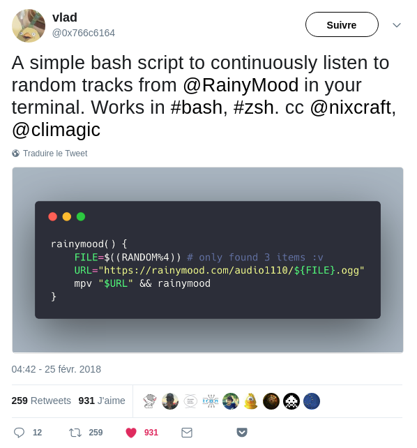

# naturemood
Nature ambiance recordings from the command-line.

# Inspiration

A few months ago, I was browsing Twitter and stumbled on `rainymood`, a small bash function to launch rain sounds from the command line.
I found it funny, added it to my `.bashrc`, and have been using it from time to time.



The American National Park has been recently releasing [amazing ambient recordings](https://findyourpark.com/news/parktracks), so I was inspired to compile the recordings and create this small script.

Listen & relax!

# Installation

Tested on Ubuntu, the only requirement is [`mpv`](https://mpv.io/installation/).

```bash
# mpv installation
$ sudo add-apt-repository ppa:mc3man/mpv-tests
$ sudo apt-get install mpv

# script fetching
$ wget --no-check-certificate -q -O - http://github.com/ClementC/naturemood/raw/master/naturemood

# make script executable
$ chmod +x naturemood
```

# Usage

Just execute the script, it will randomly choose a recording and start playing it!

```bash
$ ./naturemood
Now playing Dawn Wetland Soundscape from Moraine Park
Now playing Thunderstorm, Rain and Hail Soundscape from the Sunrise Campsite
```